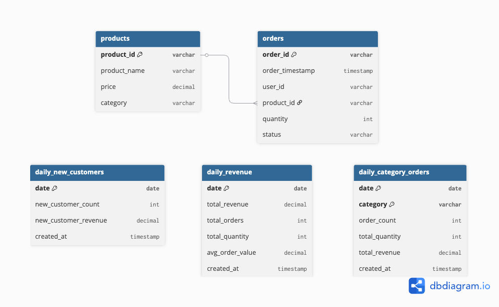

# Data Model – Problem 1 Batch Pipeline
This document describes the data model used by the batch pipeline in Problem 1.

**The pipeline generates three main types of metrics**
1. Daily revenue
2. Daily new customers
3. Daily order metrics by product category

---

## Source Tables

### products
This table stores product information and is used as reference data.

| Column | Type | Description |
|--------|------|-------------|
| product_id | VARCHAR | Primary Key |
| product_name | VARCHAR | Product name |
| price | DECIMAL | Unit price |
| category | VARCHAR | Product category |

### orders
This table stores transactional order data.

| Column | Type | Description |
|--------|------|-------------|
| order_id | VARCHAR | Primary Key |
| order_timestamp | TIMESTAMP | When order was placed |
| user_id | VARCHAR | Customer ID |
| product_id | VARCHAR | Foreign Key to products |
| quantity | INT | Order quantity |
| status | VARCHAR | Order status |

Only orders with `status = 'COMPLETE'` are included in all calculations.

## Destination Tables
The batch pipeline writes aggregated results into 3 daily tables.
These tables are designed to be easy to query for reporting and analysis.

### 1. daily_revenue 
Store overall revenue and order metrics for each day.

**Granularity:**  One row per day

| Column | Type | Description |
|--------|------|-------------|
| date | DATE | Business date (PK) |
| total_revenue | DECIMAL | Total revenue for the day |
| total_orders | INT | Number of completed orders |
| total_quantity | INT | Total quantity ordered |
| avg_order_value | DECIMAL | Average revenue per order |
| created_at | TIMESTAMP | Record creation timestamp |

### 2. daily_new_customers
Store daily new customer metrics.

**Business Definition:**  A new customer is a user who places their **first completed order** on that day.

**Granularity:**  One row per day

| Column | Type | Description |
|--------|------|-------------|
| date | DATE | Date of first purchase (PK) |
| new_customer_count | INT | Number of users who purchased for the first time |
| new_customer_revenue | DECIMAL | Revenue from new customers |
| created_at | TIMESTAMP | Record creation timestamp |

### 3. daily_category_orders
Store daily order and revenue metrics grouped by product category.

**Granularity:**  One row per `(date, category)`

| Column | Type | Description |
|--------|------|-------------|
| date | DATE | Business date (PK) |
| category | VARCHAR | Product category (PK) |
| order_count | INT | Number of completed orders |
| total_quantity | INT | Total quantity ordered |
| total_revenue | DECIMAL | Total revenue for the category |
| created_at | TIMESTAMP | Record creation timestamp |

## Aggregation Logic
- All metrics are calculated at a **daily level**
- Orders are joined with products to get price and category information
- Revenue is calculated as `price × quantity`
- Only completed orders are included

## Incremental Processing
The pipeline processes data **one day at a time**.
- Orders are filtered by the execution date
- Existing data for that date is deleted before new data is inserted
- This allows the pipeline to be safely re-run for the same date