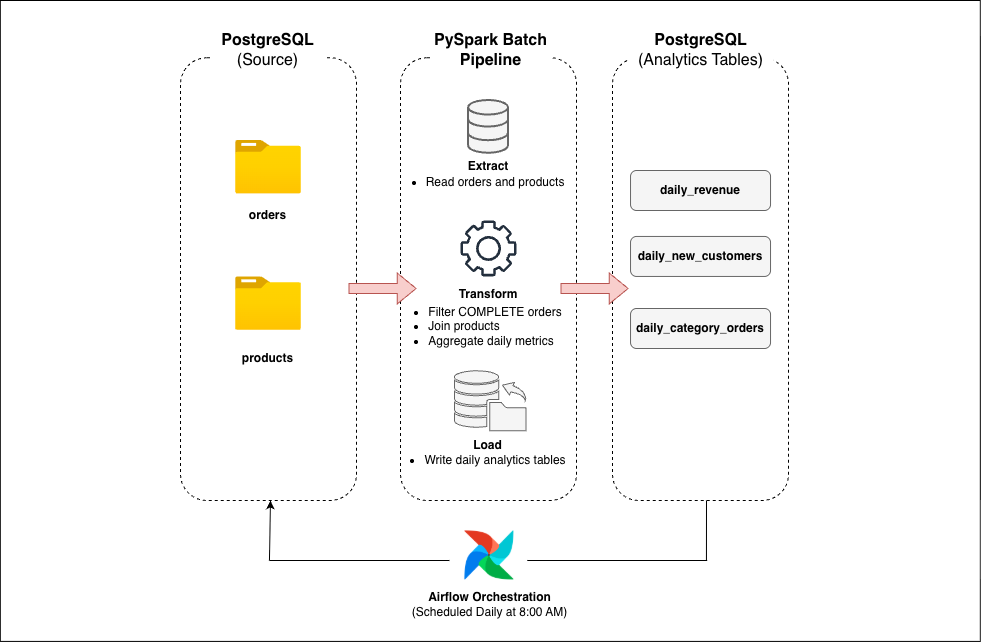

# Problem 1 – Batch Pipeline Solution
This document explains how I designed and built the batch pipeline for Problem 1.
The goal of this pipeline is to generate daily analytics data from order transactions.

## Architecture

*Figure: High-level batch pipeline flow for Problem 1*

The pipeline reads transactional data from PostgreSQL, processes it using a PySpark batch job, and writes daily aggregated results back to PostgreSQL.
The entire process is orchestrated by Airflow and runs once per day.

- **Processing:** PySpark
- **Orchestration:** Apache Airflow
- **Schedule:** Daily at 08:00 AM

## Components
### PySpark Batch Job
The Spark job
- Reads order and product data from PostgreSQL
- Filters only completed orders
- Calculates daily metrics
- Writes aggregated results to destination tables

### Airflow DAG
The Airflow DAG
1. Creates destination tables if they do not exist
2. Deletes existing data for the execution date
3. Runs the Spark batch job
4. Performs a basic data quality check
5. Logs a daily summary


## ETL Process
### Extract
- Orders are loaded only for the execution date
- Products are loaded as a reference table

### Transform
The pipeline calculates three types of metrics:
1. **Daily revenue metrics**
2. **Daily new customers**
3. **Daily order metrics by product category**

Revenue is calculated as `price × quantity`, and only orders with
`status = 'COMPLETE'` are included.

### Load
The pipeline uses a **delete and insert** strategy:
- Existing data for the execution date is deleted
- Fresh aggregated data is inserted

## Incremental Processing

The pipeline processes data **one day at a time**.

- Each run receives an execution date from Airflow
- Only data for that date is processed
- Historical data is not reprocessed

This design makes the pipeline efficient and easy to re-run if needed.


## Data Quality
After loading data, the pipeline checks that
- Data exists for the execution date
If the check fails, the DAG fails to prevent incorrect reporting.


## How to Run
1. Start services using Docker
```bash
  cd problem-1
  docker-compose up -d
```
2. Open the Airflow UI http://localhost:8081
   - Username: admin
   - Password: admin

3. Enable and trigger the `daily_order_analytics` DAG

SQL answers for Problem 1 are available in the `sql/` directory and can be executed using 
```bash
chmod +x run_queries.sh
./run_queries.sh
```

## Summary
This batch pipeline converts raw order data into simple daily analytics tables.
It demonstrates core data engineering concepts such as incremental processing,
idempotency, and orchestration using Spark and Airflow.